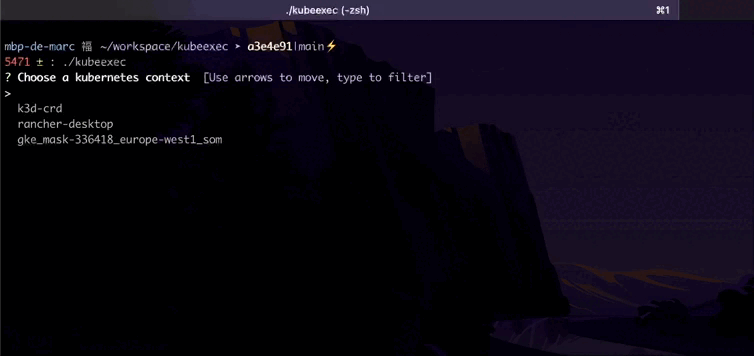

# Kubeexec

Just a CLI to execute enter into a kubernetes pod (/bin/sh or /bin/bash) (I always forget the syntax of the command to execute)

<p align="center">
    
</p>

## Usage

The CLI asks some questions about which context, namespace, pod you want to use in order to enter into the pod

```
kubeexec
```